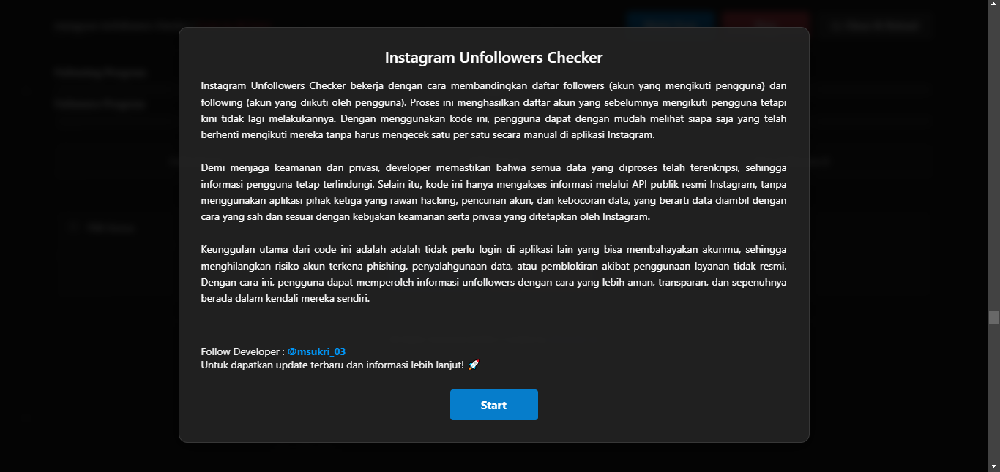
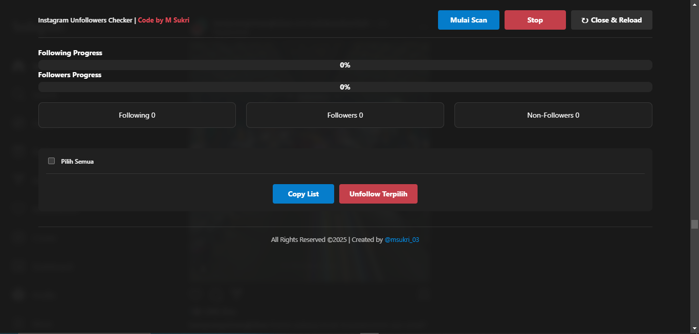

# Instagram Unfollowers Checker

Instagram Unfollowers Checker adalah code script yang memungkinkan pengguna untuk melihat daftar akun yang telah berhenti mengikuti mereka di Instagram. Dengan menggunakan metode yang aman dan sesuai kebijakan Instagram, script ini membantu pengguna dalam mengelola interaksi mereka tanpa harus mengecek satu per satu secara manual. | **Created by [M Sukri](https://www.instagram.com/msukri_03/)**

Browser-based and requires no downloads or installations!

## 🚀 Fitur Utama
- **Cek Unfollowers**: Bandingkan daftar followers dan following untuk mengetahui siapa yang berhenti mengikuti akunmu.
- **Tanpa Aplikasi Pihak Ketiga**: Tidak perlu menggunakan aplikasi luar yang berisiko terhadap hacking atau pencurian akun.
- **Keamanan Terjamin**: Menggunakan enkripsi data dan hanya mengakses API publik resmi Instagram.
- **Mudah Digunakan**: Proses otomatis tanpa perlu pengecekan manual.
- **Tanpa Login di Aplikasi Lain**: Login hanya dilakukan melalui situs web resmi Instagram untuk menjaga keamanan akun.

## 🔒 Keamanan dan Privasi
Developer sangat peduli dengan keamanan dan privasi pengguna. Oleh karena itu:
- **Tidak ada penyimpanan data sensitif**: Semua data diproses secara lokal dan tidak dikirim ke server eksternal.
- **Menggunakan API resmi Instagram**: Data diambil dengan cara yang sah dan sesuai dengan kebijakan privasi Instagram.
- **Tidak meminta informasi login**: Pengguna hanya login melalui situs web resmi Instagram.
- **Selalu waspada terhadap layanan yang meminta informasi login atau akses token Instagram Anda**.

## 📌 Cara Penggunaan
1. **Copy code** berikut dari url ini **[Instagram Unfolowers Checker Github](https://msxky.github.io/InstagramUnfollowersChecker/)**.
1. **Buka browser** dan login ke Instagram melalui **[instagram.com](https://www.instagram.com/)**.
2. **Buka Developer Tools** dengan menekan `F12` atau `Ctrl + Shift + J` (untuk Windows) atau `Cmd + Option + J` (untuk Mac).
3. **Tempelkan kode di bagian console**, lalu tekan `Enter` untuk menjalankannya.
4. **Script akan membandingkan daftar followers dan following** untuk menampilkan akun yang berhenti mengikuti.
5. **Lihat hasilnya** dalam format yang mudah dipahami.

## 📸 Preview
Berikut adalah tampilan UI  saat digunakan:

### 1️⃣ Tampilan Awal dengan Tombol Start
Saat pertama kali membuka, Anda akan melihat tombol **"Start"** untuk memulai proses.

### 2️⃣ Tampilan Saat Pertama Masuk Sebelum Scan
Setelah tombol **"Start"** ditekan, akan siap untuk mulai melakukan pemindaian.

### 3️⃣ Tampilan Setelah Scan Selesai
Setelah proses scan selesai, daftar akun yang berhenti mengikuti Anda akan ditampilkan.

## 📝 Catatan
- Semakin banyak pengguna yang harus Anda periksa, semakin banyak waktu yang dibutuhkan untuk proses perbandingan daftar followers dan following.
- Harap bersabar jika akun Anda memiliki banyak pengikut, karena proses ini akan memakan waktu lebih lama.
- **Jangan menekan tombol stop saat proses sedang berjalan**. Menekan tombol stop dapat menyebabkan ketidaksinkronan antara daftar following dan followers, yang dapat menghasilkan data yang tidak akurat.

## ⚖️ Legal
**Penyangkalan**: Ini tidak berafiliasi, terkait, diizinkan, didukung oleh, atau dengan cara apa pun secara resmi terhubung dengan Instagram.

Gunakan dengan risiko Anda sendiri! Semua data yang diproses hanya untuk tujuan pribadi dan bukan untuk tujuan komersial.

## 💬 Feedback & Dukungan
Jika Anda memiliki umpan balik, pertanyaan, atau ingin memberikan dukungan kepada pengembang, Dapat melakukannya melalui **[Sociabuzz](https://sociabuzz.com/msxki)**.

Jangan lupa untuk mengikuti saya di Instagram untuk update project menarik lainnya: **[M Sukri](https://www.instagram.com/msukri_03/)**.

Setiap dukungan anda sangat berarti dan membantu pengembang dalam mengembangkan project lainnya lebih lanjut!

**Terima kasih atas perhatian dan dukungannya! 🙏**

---

Gunakan code script ini dengan bijak dan selalu prioritaskan keamanan akun Anda!
🚀 **Stay safe!** 🔒
